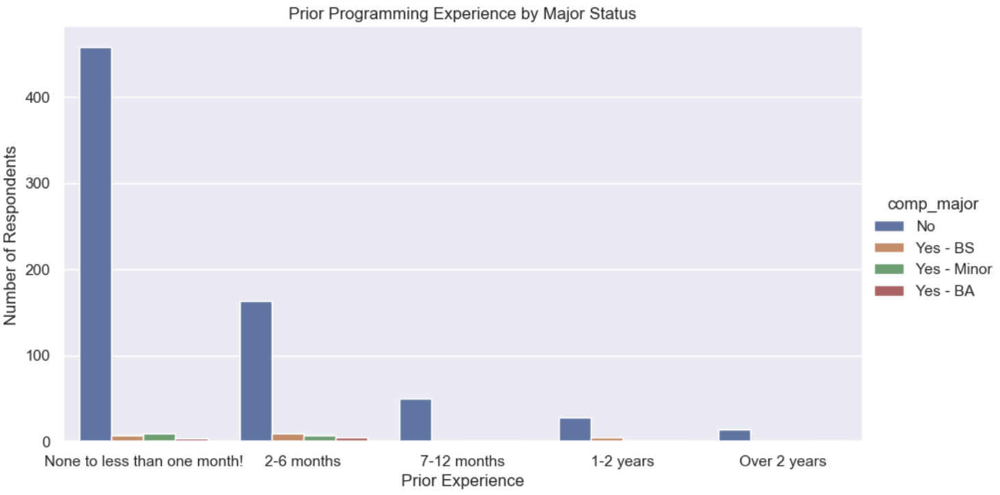
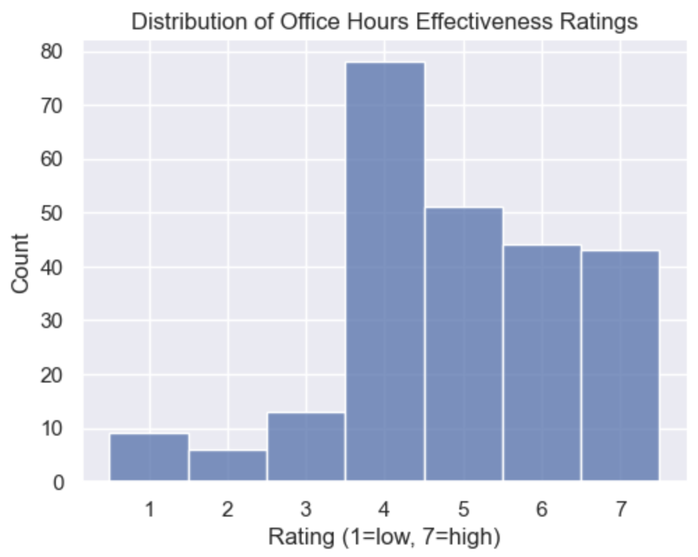
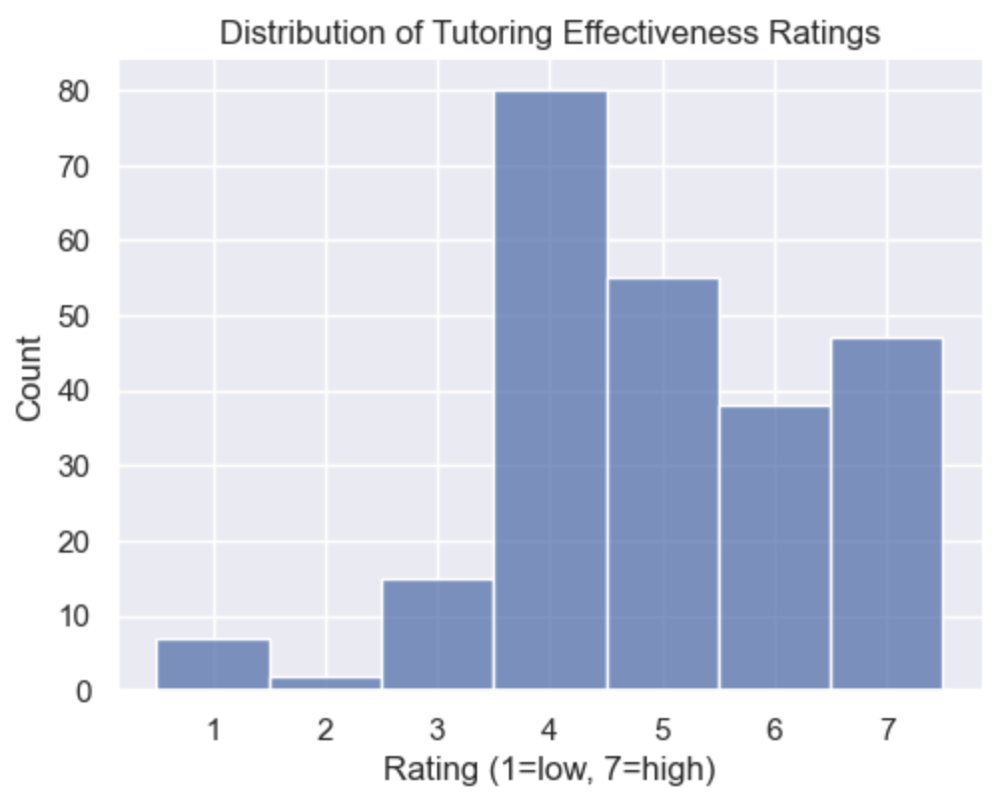
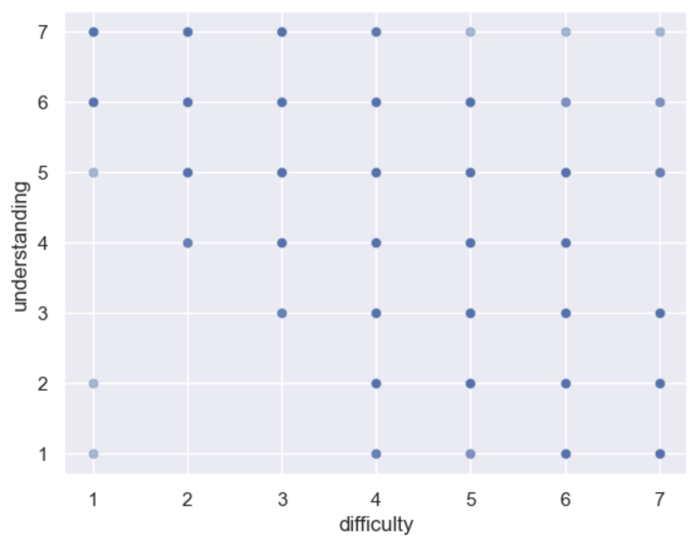

---
# Do not edit the text between these lines!
layout: default
---

# COMP110 Continuous Improvement Analysis

## Summary

For this project, we analyzed anonymous COMP110 survey data to explore whether
teaching students how to use the VSCode debugger would be a valuable addition
to the course curriculum.

We started by examining **who takes COMP110** — looking at students' majors,
graduation years, and prior programming experience. We then investigated
**how effective existing support resources** (office hours and tutoring) are,
and finally looked at the relationship between **course difficulty and student
understanding**.

---

## Visualizations

### Chart 1: Prior Programming Experience by Major Status

This chart shows the distribution of prior coding experience among respondents,
broken down by whether they plan to major in CS or a related field. The majority
of students reported little to no prior experience, and most are not CS majors.

<!-- Replace with your actual chart image -->

---

### Chart 2: Office Hours and Tutoring Effectiveness Ratings

These histograms show how students rated the effectiveness of office hours and
tutoring on a scale of 1 (low) to 7 (high). Both resources received largely
positive ratings, with most respondents scoring them 5 or above.

<!-- Replace with your actual chart image -->

---

### Chart 3: Course Difficulty vs. Student Understanding

This scatterplot compares how difficult students found the course (1 = very easy,
7 = very hard) against their self-reported level of understanding (1 = lost,
7 = understands everything). Darker clusters indicate more responses at that
combination.

<!-- Replace with your actual chart image -->

---

## Conclusions

Our analysis explored whether teaching students how to use the VSCode debugger 
to step through and fix their own code would be a valuable addition to COMP110. 
We initially assumed that most students in COMP110 were pursuing CS or a related 
STEM field, and that debugging skills would therefore be broadly applicable 
and worth dedicating instructional time to.

However, our data did not fully support this assumption. Approximately 63% of 
COMP110 students reported no prior CS experience, and over 90% indicated they 
are not planning to major in CS. This suggests that the majority of students 
are taking COMP110 to fulfill a degree requirement rather than as a stepping 
stone into a CS career path. For these students, learning to operate a 
specialized debugging tool may feel disconnected from their academic goals, 
reducing the practical value of such an addition.

We also examined how students rated the effectiveness of existing support 
resources. Both office hours and tutoring received predominantly positive 
ratings, with the majority of respondents scoring them 5 or above out of 7. 
This indicates that when students encounter bugs or confusion in their code, 
they already have accessible and well-regarded avenues for help.

Based on these findings, our data does not strongly support making the VSCode 
debugger a required component of COMP110. For the majority of students, who 
are non-CS majors with no prior experience, the learning overhead of mastering 
a debugging interface may outweigh its benefits. Unit testing, which is already 
part of the curriculum, likely serves this audience better as a structured way 
to verify and understand their code.

That said, we still believe there is merit in introducing the debugger as an 
optional, low-stakes enrichment topic. Importantly, VSCode's built-in Python 
Debugger extension is well-suited for beginners. This makes a brief 
introduction feasible even at the COMP110 level. It could, for example, be 
woven into an existing unit testing lesson as an optional extension: students 
who are curious or planning to continue in CS could explore it, while others 
are not required to master it or be assessed on it.

The primary trade-off is instructional time. Adding any new content means 
reducing time spent elsewhere, and professors and TA would need to support 
debugging-related questions in office hours. Students who find the tool 
confusing might also feel unnecessarily overwhelmed if it is not introduced 
carefully. Keeping it optional and ungraded would help mitigate these concerns 
while still creating value for the subset of students who stand to benefit most.